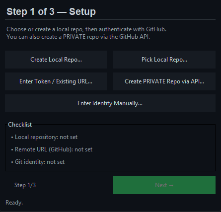
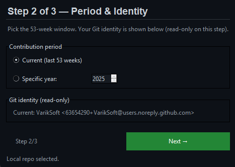
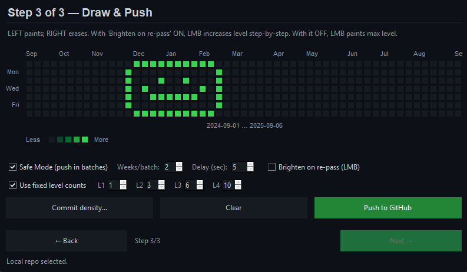

<p align="center">
  
  
  
  
  
  
</p>

# 🎨 GitHub Pixel Art — Contribution Graph Painter

A desktop app that **paints pixel art on your GitHub contribution graph** by creating timestamped commits (with real dates) into a repository.  
It looks and feels like GitHub’s grid: **53 weeks × 7 days**, month labels, “Less → More” legend, and familiar greens.

> [!WARNING]
> Please respect GitHub’s Terms of Service and community guidelines. Use this tool responsibly.

## ✨ Highlights

- **Step-by-step wizard (3 steps)** — setup repo & auth → pick period & identity → draw & push.
- **Private repo creation via GitHub API** (with your personal access token).
- **Auto Git identity from token** — uses GitHub **no‑reply** email (login/id) so contributions count.
- **Exact GitHub-like canvas** — 53×7 grid, month labels aligned to the first column of each month.
- **Painting tools**
  - **LMB**: paint. With *Brighten on re‑pass* ON, brightness increases (L1→L4) as you re‑enter a cell; with it OFF, LMB paints **max brightness** at once.
  - **RMB**: erase.
  - Drag to paint/erase multiple cells.
- **Commit density control**
  - **Fixed level counts** (deterministic): set exact commits per brightness level (L1…L4).
  - Or **range mode**: enter `N` or `M-N` and the app maps levels into that range.
- **Safe Mode (batch pushes)** — push in weekly batches with a configurable delay; helps avoid rate/latency hiccups on huge artworks.
- **Year chooser** — current rolling 53 weeks or a specific year.

## 🚀 Getting Started

### 1) Clone & install
```bash
git clone https://github.com/VarikSoft/github-pixel-art.git   # (or place bot.py in any folder)
cd github-pixel-art
pip install --upgrade pip
pip install gitpython requests
```

### 2) Run
```bash
python bot.py
```

> [!NOTE]
> **Git must be in PATH.** Check: `git --version`.

### 3) Create a GitHub token
Create a **fine‑grained** or **classic** personal access token with repository permissions (classic: scope `repo`).  
Keep it private; you’ll paste it into the app.

## 🧭 Usage (3 Steps)

### **Step 1 — Setup**
- **Create Local Repo** or **Pick Local Repo…**
- **Enter Token / Existing URL** — paste your PAT and the repo HTTPS URL.
- Optional: **Create PRIVATE Repo via API** — the app will create it and fill the remote URL.
- Optional: **Enter Identity Manually** — override `user.name` / `user.email`.
- The checklist turns **OK** when everything is ready. Click **Next →**.



### **Step 2 — Period & Identity**
- Choose **Current (last 53 weeks)** or **Specific year**.
- Identity is shown (auto from token with no‑reply email, or what you set manually). Click **Next →**.



### **Step 3 — Draw & Push**
- **Paint** your pixels:
  - **LMB** paints. With **Brighten on re‑pass** ✔️ it increments brightness up to L4; with it ❌ it paints L4 immediately.
  - **RMB** erases.
- **Commit density…**
  - **Fixed level counts** ✔️ (default): set commits per level L1..L4 (e.g., L1=1, L2=3, L3=6, L4=10) → very predictable colors.
  - **Range mode** ❌: enter `N` or `M-N` (e.g., `3-8`) and levels are mapped within that range.
- **Safe Mode (push in batches)** ✔️ — choose **weeks/batch** and **delay** to push progressively.
- Click **Push to GitHub**. After it finishes, on your profile open **Contribution settings** and enable **“Include private contributions”**.



## ⚙️ How it works

- The app writes to a file (e.g. `pixels.txt`) in your repo and commits with **custom dates** (`GIT_AUTHOR_DATE` / `GIT_COMMITTER_DATE` set to **12:00 UTC** of the selected day).  
- Brightness levels map to **number of commits** on that day:
  - In **Fixed** mode, you control L1…L4 exact counts.
  - In **Range** mode, L1..L4 are binned within `M…N`.
- **Safe Mode** groups columns by weeks and pushes between batches (with delay).

## 🧯 Troubleshooting

**Contributions don’t appear**
- In your GitHub profile → **Contribution settings** → enable **Include private contributions**.
- The commits’ email must match your GitHub **no‑reply** or verified email. With token, the app auto‑uses `123456+login@users.noreply.github.com`.
- Make sure the selected **dates are within the visible 53‑week window**.
- Wait a little; the graph refresh may lag briefly.

**`fatal: The current branch ... has no upstream`**
- The app sets upstream on first push; if interrupted, run a normal push once: `git push -u origin main`.

**`Updates were rejected because the remote contains work that you do not have`**
- Remote is ahead. The app will try to fast‑forward/merge. If still failing, it asks to **force-with-lease**. You can also pull or rebase manually.

**`'git': 'credential-manager-core' is not a git command`**
- We disable credential helpers internally, but if you see this, ensure Git for Windows is updated or ignore (the app embeds token in the remote URL during push).

**Token safety**
- The remote URL is temporarily rewritten as `https://x-access-token:<TOKEN>@github.com/...`. You can later reset it to a clean HTTPS URL:
  ```bash
  git remote set-url origin https://github.com/OWNER/REPO.git
  ```

## 📦 Project Structure (typical)
```
github-pixel-art/
├── bot.py           # the GUI application
├── pixels.txt       # generated log file of dated commits
└── README.md
```

## 📝 License
MIT — see [LICENSE](./LICENSE).

## 🙌 Contributing
Issues and PRs are welcome!
